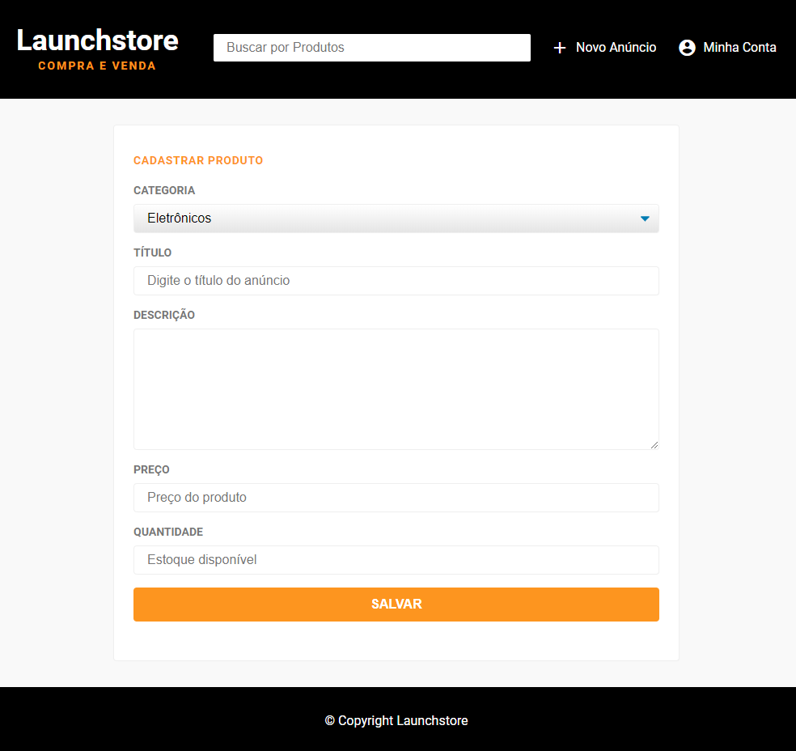

<h1 align="center">
    
</h1>

<h3 align="center" >
  An ecommerce based in pure javascript and pure SQL queries
</h3>

  
  
  
  
   
  

  
  
  
  
  

<a href="#rocket-environment">Environment</a>&nbsp;&nbsp;&nbsp;|&nbsp;&nbsp;&nbsp;
  <a href="#computer-languages">Languages</a>&nbsp;&nbsp;&nbsp;|&nbsp;&nbsp;&nbsp;
  <a href="#books-technologies">Technologies</a>&nbsp;&nbsp;&nbsp;|&nbsp;&nbsp;&nbsp;
  <a href="#memo-license">License</a>

## :rocket: Environment

- **https://atp-launchstore.herokuapp.com/**

## :computer: Languages

- **HTML**
- **CSS**
- **Javascript**

## :books: Technologies

- **dotenv**: ^8.2.0
- **express**: ^4.17.1
- **intl**: ^1.2.5
- **method-override**: ^3.0.0
- **nunjucks**: ^3.2.0
- **pg**: ^8.0.0

### devDependencies

- **browser-sync**: ^2.26.7
- **nodemon**: ^2.0.2
- **npm-run-all**: ^4.1.5

## :memo: License

This project is under MIT. See at here [LICENSE](/LICENSE) for more informations.

---

Made by :blue_heart: by [Arthur Pedroti](https://github.com/ArthurPedroti)
